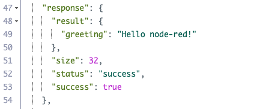

## node-red example

This is the example flow:


This is the flow, now you can connect it to the IBM Cloud Function (serverless):


So you need to edit the Openwhisk node:


And this is set up:


And then you can wire it to the Cloudant DB:


```
[
    {
        "id": "6fcea682.ad65e8",
        "type": "inject",
        "z": "824ae320.7640d",
        "name": "",
        "props": [
            {
                "p": "payload"
            },
            {
                "p": "topic",
                "vt": "str"
            }
        ],
        "repeat": "",
        "crontab": "",
        "once": false,
        "onceDelay": 0.1,
        "topic": "",
        "payload": "",
        "payloadType": "date",
        "x": 150,
        "y": 240,
        "wires": [
            [
                "5c4fb522.91914c"
            ]
        ]
    },
    {
        "id": "5c4fb522.91914c",
        "type": "function",
        "z": "824ae320.7640d",
        "name": "",
        "func": "msg.payload={'name':'node-red'};\nreturn msg;",
        "outputs": 1,
        "noerr": 0,
        "initialize": "",
        "finalize": "",
        "libs": [],
        "x": 330,
        "y": 300,
        "wires": [
            [
                "949d3ea1.c80cf8",
                "e9ee9a74.f9483"
            ]
        ]
    },
    {
        "id": "949d3ea1.c80cf8",
        "type": "openwhisk-action",
        "z": "824ae320.7640d",
        "name": "",
        "func": "",
        "namespace": "your@login.here_dev",
        "action": "node-red-flow/helloworld",
        "params": [
            {
                "disabled": true
            }
        ],
        "service": "6caa1679.6a3938",
        "edit": false,
        "x": 580,
        "y": 400,
        "wires": [
            [
                "632ae2fa.e5c7a4",
                "7440722c.6e1984"
            ]
        ]
    },
    {
        "id": "632ae2fa.e5c7a4",
        "type": "debug",
        "z": "824ae320.7640d",
        "name": "",
        "active": true,
        "tosidebar": true,
        "console": false,
        "tostatus": false,
        "complete": "false",
        "statusVal": "",
        "statusType": "auto",
        "x": 740,
        "y": 280,
        "wires": []
    },
    {
        "id": "7440722c.6e1984",
        "type": "function",
        "z": "824ae320.7640d",
        "name": "",
        "func": "\nreturn msg;",
        "outputs": 1,
        "noerr": 0,
        "initialize": "",
        "finalize": "",
        "libs": [],
        "x": 750,
        "y": 480,
        "wires": [
            [
                "c25c74ba.a0b088"
            ]
        ]
    },
    {
        "id": "c25c74ba.a0b088",
        "type": "cloudant out",
        "z": "824ae320.7640d",
        "name": "",
        "cloudant": "",
        "database": "nodered-test",
        "service": "your-Cloudant-60050",
        "payonly": false,
        "operation": "insert",
        "x": 1000,
        "y": 520,
        "wires": []
    },
    {
        "id": "e9ee9a74.f9483",
        "type": "debug",
        "z": "824ae320.7640d",
        "name": "",
        "active": true,
        "tosidebar": true,
        "console": false,
        "tostatus": false,
        "complete": "false",
        "statusVal": "",
        "statusType": "auto",
        "x": 500,
        "y": 220,
        "wires": []
    },
    {
        "id": "6caa1679.6a3938",
        "type": "openwhisk-service",
        "name": "node-red-flow/helloworld",
        "api": "https://openwhisk.ng.bluemix.net/api/v1"
    }
]
```
